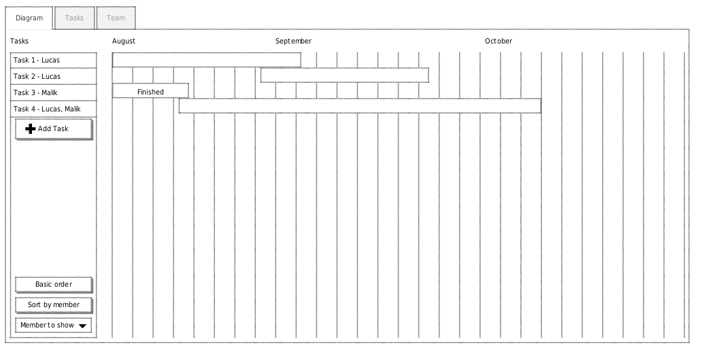
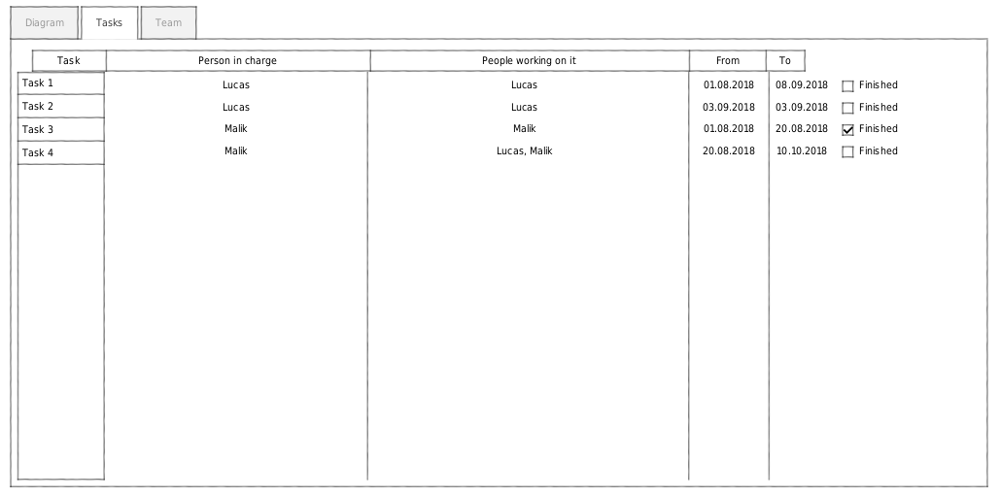

\newpage

\tableofcontents

\newpage

# Introduction

Pour ce projet d'HES d'été 2018, le but sera de développer une application web desktop avec le framework Electron. L'application sera donc développée en HTML/CSS et Javascript. Ce document listera les fonctionnalités détaillées de cette application.

L'application, nommée ElectroGantt, sera graphique et permettra de faire des diagrammes de Gantt simple et de gérer une liste de tâches. Les données créées par l'utilisateur seront ensuite enregistrer dans un fichier local type JSON ou XML.

## Electron

Elecron permet le développement d'application graphique desktop en utilisant des technologies frontend et backend originellement faites pour des application web. Notamment avec Node.js pour le backend et Chromium pour le frontend.

https://en.wikipedia.org/wiki/Electron_(software_framework)

## Lien de la forge

 - https://salut.ch

# Fonctionnalités essentielles

Cette liste de tâches est les tâches qui devront être faites pour remplir les objectifs finaux de l'application

## Ouverture du programme

Lorsque le programme est ouvert, il va ouvrir le dernier fichier ouvert. S'il n'y en a pas ou que le fichier n'existe plus. Il y aura un écran très simple avec 3 boutons, Nouveau, Ouvrir et Quitter.

## Projet

Un projet sera constitué d'un nom, d'une équipe et d'une listes de tâches. Chaque tâche aura une ou plusieurs personnes affectées à la réalisation, un reponsable et une date de fin et une date de début.

On pourra également marqué une tâche comme finie ou non afin de mieux visualiser l'avancement du projet.

## Afficher un diagramme et sa liste de tâches

Afficher la liste des tâches sous forme de digramme de Gantt. Chaque tâches aura une couleur en fonction de la personne responsable. Mais une couleur autre peut être spécifiée.

Il sera également possible d'ajouter / modifier des tâches et leur date de début/fin directement sur le diagramme de Gantt.

Il sera également possible de trier (uniquement à l'affichage) les tâches par utilisateur ou d'afficher uniquement les tâches d'un utilisateur.

### Diagramme

### Liste de tâches

## Equipe

Fenêtre d'édition afin d'ajouter, modifier et supprimer des personnes au projet. Une personne possèdera un nom et une couleur.

Maquette

## Créer une liste de tâches

Fenêtre d'édition des tâches du projet. Les tâches ont plusieurs données tel que :

- Responsable
- Personne travaillant sur la tâche
- Date de début et de fin
- Status (terminé / pas terminé)

Maquette

## Sauvegarder dans un fichier

Le projet sera sauvegarder dans un fichier JSON. Ce format texte est très adapté aux applications Javascript et le format texte permet d'éditer facilement le fichier. En plus de permettre l'historique du fichier via Git.

# Fonctionnalités optionnelles

Cette liste de tâches est contient les tâches qui seront réalisées s'il y a du temps à disposition et ne fait donc pas partie des objectifs du résultat final.

## Interface git

Permettre de commit et de push le fichier du projet dans le repository du projet du dossier en cours.

## Zoomer sur la vue du diagramme de Gantt

Cette fonctionnalité permettra d'afficher le diagramme sur une largeur choisie par l'utiliseur (Par ex: Afficher le calendrier par mois, jours, semaines ...)

## Récapitulatif d'avancement du projet

Afficher les tâches à commencer, les tâches en cours, les tâches en retard et les tâches terminée

## Organiser les tâches par groupe

Faire une système de groupe qui permettra de mettre les tâches dans un groupe et de faire une arborescence. Par exemple :

- Groupe 1
  - Tâche 1.1
  - Tâche 1.2
  - Groupe 1.1
    - Tâche 1.1.2
- Tâche 1
